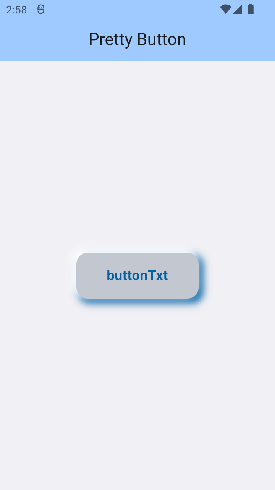
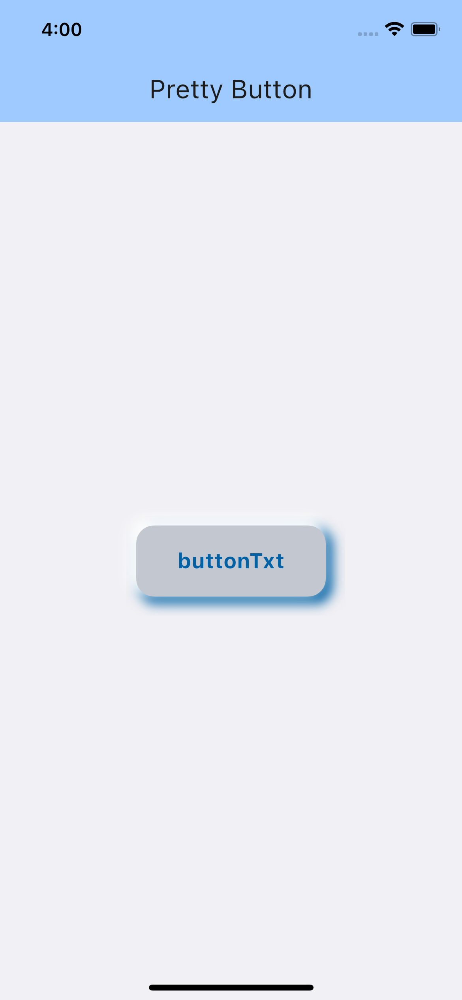
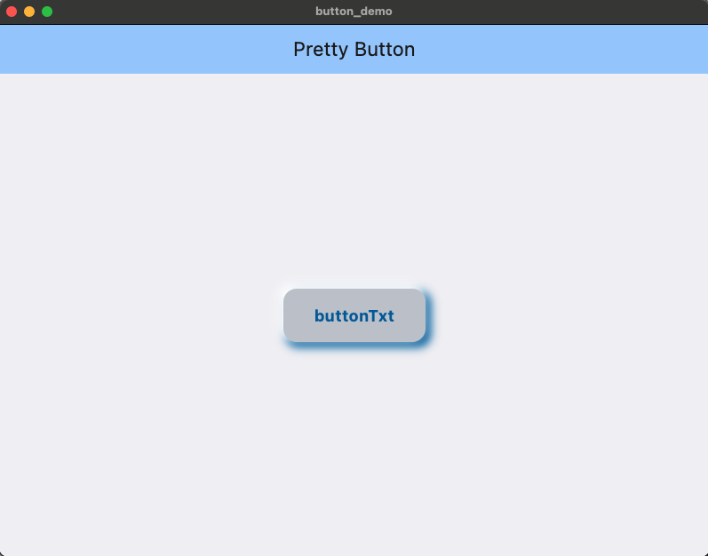
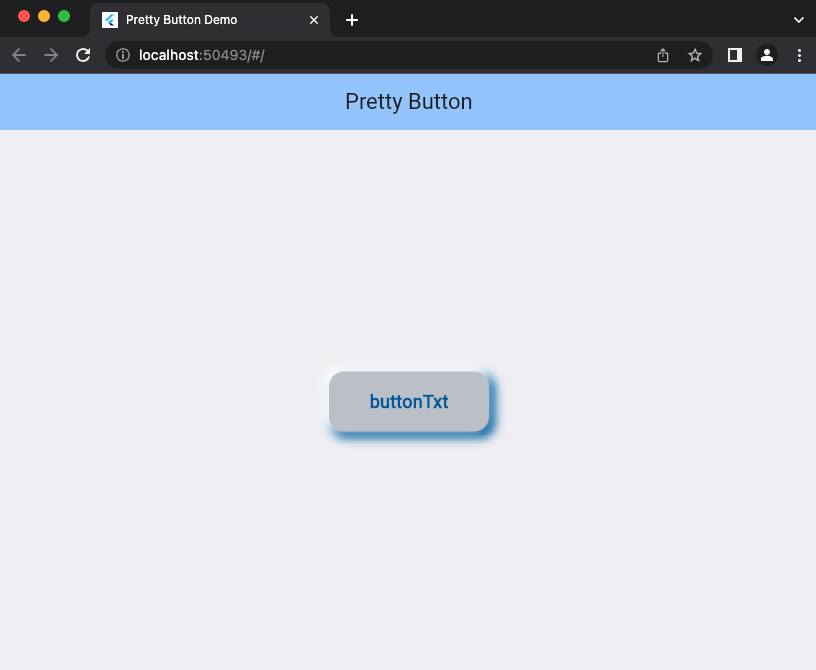

# pretty_button

`pretty_button` a pretty and customizable 3D button for your flutter project.

### Platform Support

| Android | iOS | Web | MacOS | Linux | Windows |
| :-----: | :-: | :---: | :-----: | :-: | :---: |
| &#9989; | &#9989; | &#9989; | &#9989; | &#9989; | &#9989; |






### Installation

Add it as a dependency in their `pubspec.yaml`:


1. Add the latest version of package to your pubspec.yaml (and run`dart pub get`):
```yaml
dependencies:
pretty_button: ^0.0.1
```
2. Import the package and use it in your Flutter App.
```dart
import 'package:fancy_containers/fancy_containers.dart';
```

### Customizations

| Attribute           |    Type    |     Default      | Description                                                |
|:--------------------|:----------:|:----------------:|:-----------------------------------------------------------|
| `topShadowColor`    |  `Color`   |   `onPrimary`    | shadow color of top and left side, defaults to onPrimary   |
| `bottomShadowColor` |  `Color`   |    `primary`     | Shadow color of bottom and right side, defaults to primary |
| `backgroundColor`   |  `Color`   | `outlineVariant` | The background color of button, defaults to outlineVariant |
| `innerPadding`      |  `Double`  |       `8`        | Padding of child widget, defaults to 8                     |
| `outerPadding`      |  `Double`  |       `8`        | Padding of button widget, defaults to 8                    |
| `blurRadius`        |  `Double`  |       `8`        | The blur radius of the button, defaults to 8               |
| `spreadRadius`      |  `Double`  |       `2`        | The spread radius of the button, defaults to 2             |
| `height`            |  `Double`  |       `50`       | Height of the button, defaults to 50                       |
| `width`             |  `Double`  |      `150`       | Width of the button defaults to 150,                       |
| `borderRadius`      |  `Double`  |       `15`       | The border radius of the button, defaults to 15            |
| `onTap`             | `Function` |                  | Button press handler, required*                            |
| `child`             |  `Widget`  |                  | Inner content for the button, required*                    |

### Usage

```
...
import 'package:pretty_button/pretty_button.dart';
...
```

```
PrettyButton(
  innerPadding: const EdgeInsets.all(8.0),
  outerPadding: const EdgeInsets.all(8.0),
  width: 150,
  height: 50,
  blurRadius: 8,
  spreadRadius: 2,
  borderRadius: 15,
  topShadowColor: Theme.of(context).colorScheme.onPrimary,
  bottomShadowColor: Theme.of(context).colorScheme.primary,
  backgroundColor: Theme.of(context).colorScheme.outlineVariant,
  onTap: (finish) {
    print('On tap called');
  },
  child: Text(
    'buttonTxt',
    style: TextStyle(color: Theme.of(context).colorScheme.primary, fontSize: 18,fontWeight: FontWeight.bold),
  ),
);
```

Check example folder for more.